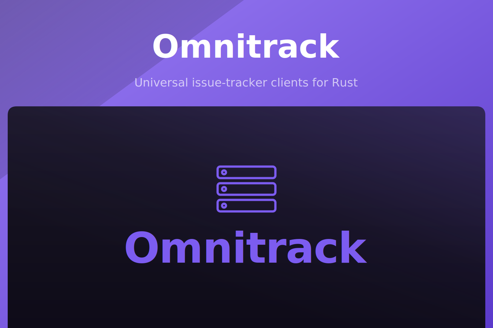

<p align="center">
  
</p>

<p align="center">
  <a href="https://crates.io/crates/omnitrack"></a>
  <a href="https://crates.io/crates/omnitrack"></a>
  <a href="https://docs.rs/omnitrack"></a>
  <a href="https://github.com/akira-io/omnitrack-rs/actions/workflows/test.yml"></a>
  
  
</p>

`omnitrack` is a universal issue-tracker provider abstraction for Rust. Linear and Jira ship as
driver modules behind feature flags inside a single crate; provider-neutral contracts (issues,
comments, labels, milestones, projects, teams, cycles, registry, pagination, errors) live at the
crate root so consumers code against one surface regardless of the backend.

## Install

CLI:

```sh
# Default: Linear driver
cargo add omnitrack

# Jira only
cargo add omnitrack --no-default-features --features jira

# All providers
cargo add omnitrack --features all

# Contracts only, no driver
cargo add omnitrack --no-default-features
```

By hand in `Cargo.toml`:

```toml
omnitrack = "0.3"
omnitrack = { version = "0.3", default-features = false, features = ["jira"] }
omnitrack = { version = "0.3", features = ["all"] }
omnitrack = { version = "0.3", default-features = false }
```

## Quick start

```rust,no_run
use omnitrack::{IssueFilter, IssueResult, Issues, provider};
use omnitrack::linear::linear;

#[tokio::main]
async fn main() -> IssueResult<()> {
    let registry = provider().register(linear())?.build();
    for descriptor in registry.descriptors() {
        println!("{} ({})", descriptor.display_name(), descriptor.id().as_str());
    }

    let token = std::env::var("LINEAR_TOKEN").unwrap_or_default();
    let client = linear().token(token).build();
    let page = client.list(IssueFilter::default(), None).await?;
    println!("fetched {} issue(s)", page.items().len());
    Ok(())
}
```

## Documentation

Full documentation lives in this repository under `docs/`. Each driver also ships its own usage
guide:

- Core contracts: `docs/00-overview.md`
- Linear driver: `docs/linear/`
- Jira driver: `docs/jira/`
- API reference on docs.rs: https://docs.rs/omnitrack

## Testing

```sh
cargo test --all-features
```

## Changelog

Please see [CHANGELOG.md](CHANGELOG.md) for what has changed recently. The changelog is generated
from conventional commits via [git-cliff](https://git-cliff.org) on every release tag.

## Contributing

Please see [CONTRIBUTING.md](CONTRIBUTING.md) for details.

## Security Vulnerabilities

Please review [our security policy](SECURITY.md) on how to report security vulnerabilities.

## Credits

- [kid](https://github.com/kidiatoliny)
- [All Contributors](https://github.com/akira-io/omnitrack-rs/graphs/contributors)

## License

Dual-licensed under either of the following, at your option:

- MIT License ([LICENSE-MIT](LICENSE-MIT) or https://opensource.org/licenses/MIT)
- Apache License 2.0 ([LICENSE-APACHE](LICENSE-APACHE) or https://www.apache.org/licenses/LICENSE-2.0)

Unless you explicitly state otherwise, any contribution intentionally submitted for inclusion in
this crate by you, as defined in the Apache-2.0 license, shall be dual-licensed as above, without
any additional terms or conditions.
